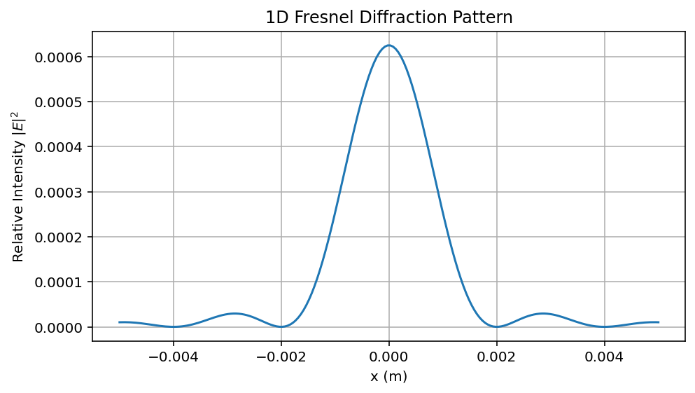
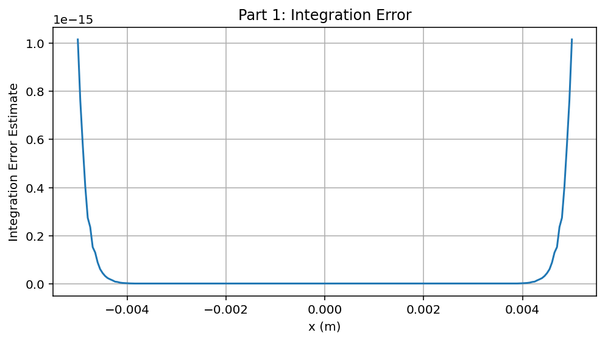
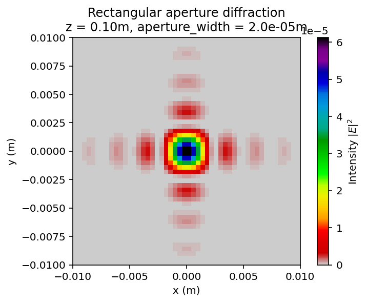
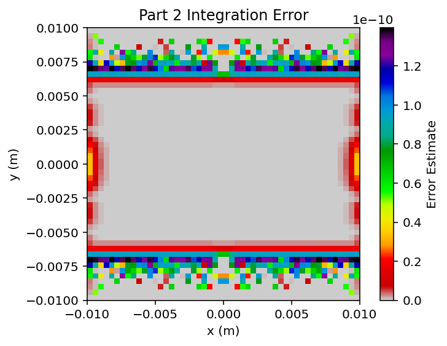
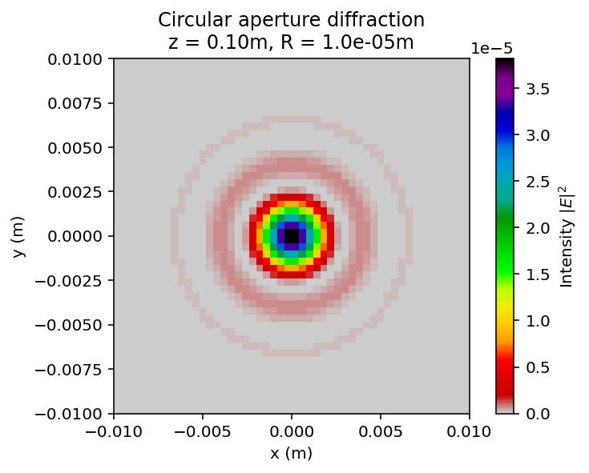
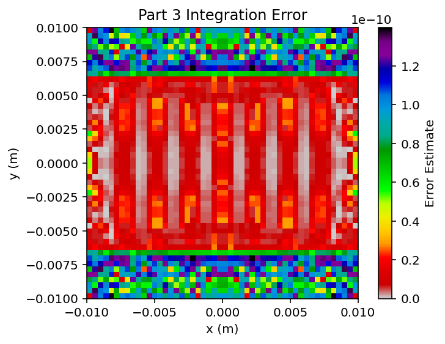
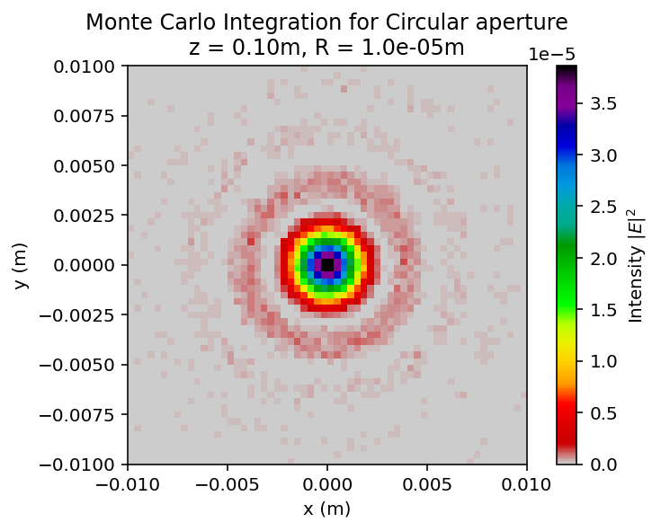
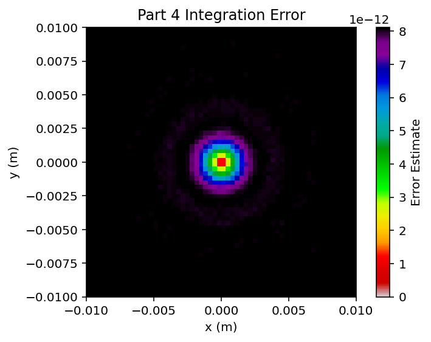

# fresnel-diffraction-monte-carlo-simulator
modeling 1D and 2D Fresnel diffraction patterns for rectangular and circular apertures. Compares deterministic numerical integration with stochastic Monte Carlo methods.

## Features & Mathematical Methods
* **1D & 2D Integration Pipelines:** Uses SciPy's `dblquad` to evaluate the real and imaginary components of the Fresnel diffraction integral.
* **Complex Aperture Geometries:** Models spatial filtering for both rectangular constraints and custom circular bounds.
* **Monte Carlo Integration:** Replaces deterministic 2D quadrature with stochastic area sampling to estimate integrals, complete with variance-based error bounding.

## Sample Output









## How to Run
```bash
# Clone repository
git clone [https://github.com/bobryanlow-dotcom/fresnel-diffraction-monte-carlo-simulator.git](https://github.com/bobryanlow-dotcom/fresnel-diffraction-monte-carlo-simulator.git)

# Run simulation
python main.py
